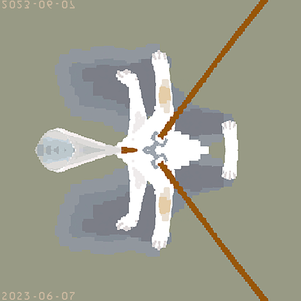

# bmp-flipper
 После сборки запуск программы осуществляется следующим образом:
 
 `.\bmp-flipper.exe <input.bmp> <output.bmp> horizontal/vertical`
# Пример работы программы
Вводим команду в терминале: `.\bmp-flipper.exe input.bmp output.bmp horizontal`

Получаем результат:

